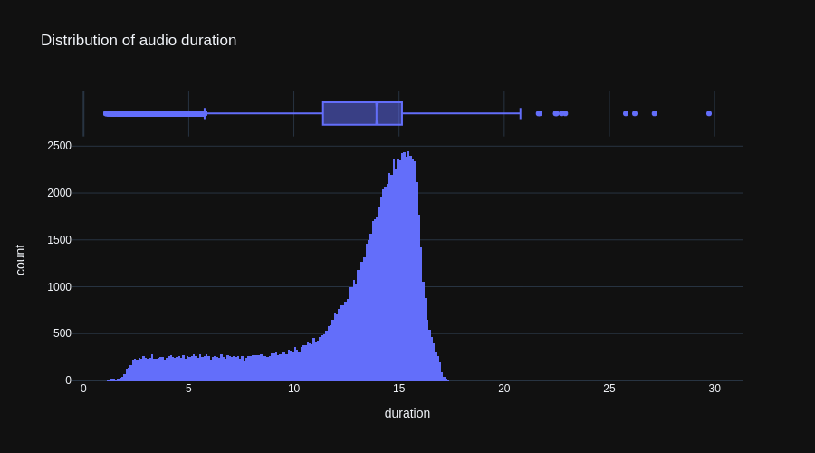
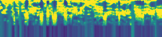
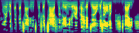

# Simple End-to-end Speech Recognition Engine from Scratch

The engine's architecture is similar to [Deepspeech2](https://arxiv.org/abs/1512.02595) and includes a tensorflow input pipeline, a conversion of audio-data to mel-spectrograms, char-tokenization of the transcription, a recurrent neural network (RNN) and CTC-loss/decoder-functions.
A [demo-app](https://github.com/to-schi/asr-deepspeech2-webdemo) of the speech recognition has been deployed on [StreamlitCloud](https://share.streamlit.io/to-schi/asr-deepspeech2-webdemo/main).

The model was trained on the [LibriSpeech](https://www.openslr.org/12/) dataset with 360 hours of reading from audiobooks. The preparation of this dataset was surprisingly complicated, as each audiobook has it's own folder and transcription file. A list of paths had to be compiled and the transciptions had to be merged to one file. Data preparation and a quick exploratory data analysis (EDA) can be seen in the data_preparation-notebook.

Before training, outliers of duration, speed and transcription-length were removed from the training-data and the remaining samples were sorted by length to produce a higher batch-consistency.

The audio-data was converted to mel-scaled spectrograms. The mel-scale takes into account that human hearing ability varies over the frequency-range. The switch from standard spectrograms to mel-spectrograms improved the word error rate (WER) on the validation data by about 10 percent.

Short-time Fourier transform spectrogram  

Mel spectrogram  

Because spectrograms are images, convolutional layers can be used to extract features from them. Additionally speech is time-series data, so it is beneficial to use bidirectional RNN layers such as gated recurrent units (GRU) to capture time-frequency patterns from the features detected by the convolutional layers.

For the training I used Google Colab Pro+ and sometimes a GPU with 40GB RAM got connected (A100-SXM4-40GB). In this case I was able to train with a batch size of 64. In most cases a Tesla V100-SXM2-16GB got connected, so the batch size could not be higher than 32. Usually the connection broke after several hours of training and had to be restarted. Overall the model trained about 60 epochs until early stopping was triggert.

As the model is trained on read speech, it does not perform as good on spontaneous speech or  especially singing. To improve the robustness of the speech recognition, data with spontaneous speech could be added or the current dataset could be augmented by the addition of noise, changes of speed and [spectrum-augmentation](https://arxiv.org/abs/1904.08779).
The word error rate (WER) when predicting the validation data (LibriSpeech clean-test) is at 13%. Improvements could be made with the use of a language model like [KenLM](https://kheafield.com/code/kenlm/) as a scorer in a beam-search at decoder-level.

This project was started during the [Spiced Academy](https://www.spiced-academy.com) Data Science Bootcamp Nov/2021.
