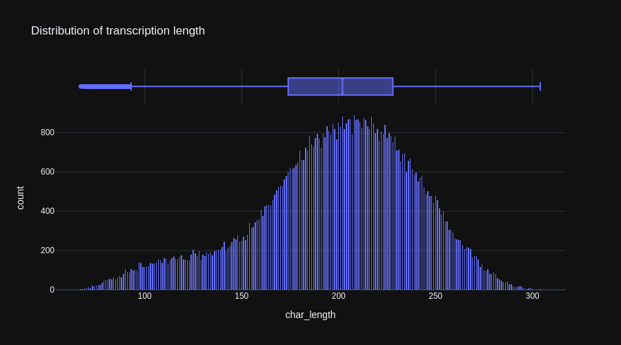
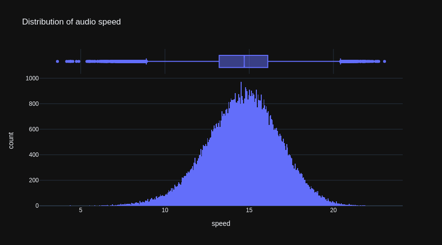
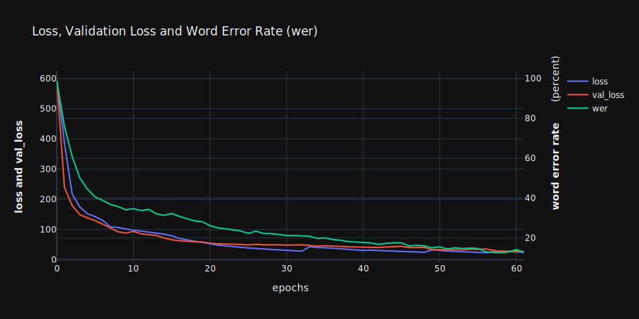

# Simple End-to-end Speech Recognition Engine from Scratch

#
Edit (12.6.2022):
In [version 2](https://colab.research.google.com/github/to-schi/speech-recognition-from-scratch/blob/main/asr_rnn_training_v2.ipynb) I used all available data from Librispeech (960 hours) and added [spectrogram augmentation](https://arxiv.org/abs/1904.08779), which reduced overfitting significantly. Also parts of the ctc-loss function were changed, which noticeably accelerated the learning of the model especially during the first epochs. Decreasing the learning rate over time is of equal importance. This could have been done with a learning rate schedule, but unfortunately the google colab runtime disconnected usually after 3 to 5 epochs. The manual schedule was like this:

| epoch | learning rate |
|-------|---------------|
| 1-3   | 0.0002        |
| 4-6   | 0.00015       |
| 7-10  | 0.0001        |
| 11-35 | 0.00008       |
| 36-49 | 0.00005       |
| 50-52 | 0.00003       |

The word-error-rate improved to about 10 % on the Librispeech test-dataset after about 52 epochs.
#

The engine's architecture is similar to [Deepspeech2](https://arxiv.org/abs/1512.02595) and includes a conversion of audio data to mel spectrograms, char-tokenization of the transcription, a tensorflow input pipeline, a recurrent neural network (RNN) and CTC-loss/decoder-functions.
A [demo-app](https://github.com/to-schi/asr-deepspeech2-webdemo) of the speech recognition has been deployed on [StreamlitCloud](https://share.streamlit.io/to-schi/asr-deepspeech2-webdemo/main).

The model was trained on the [LibriSpeech](https://www.openslr.org/12/) dataset with 360 hours of reading from audiobooks. The preparation of this dataset was surprisingly complicated, as each audiobook has it's own folder and transcription file. On the other hand this is of advantage, because Google Drive produces "Input/output" errors when handling large amounts of files in one folder. A list of paths had to be compiled for the audio files and the transciptions had to be merged to one dataframe. Data preparation and a quick exploratory data analysis (EDA) can be seen in the [asr_rnn_data_preparation](https://github.com/to-schi/speech-recognition-from-scratch/blob/main/asr_rnn_data_preparation.ipynb) notebook [(open in colab)](https://colab.research.google.com/github/to-schi/speech-recognition-from-scratch/blob/main/asr_rnn_data_preparation.ipynb).

Before training, outliers of duration, speed and transcription length were removed from the training data and the remaining samples were sorted by length to produce a higher batch-consistency. Sorting by the length of transcription performed better than by duration.

The audio data was converted to mel-scaled spectrograms. The [mel scale](https://en.wikipedia.org/wiki/Mel_scale) (melody scale) takes into account, that human hearing ability varies over the frequency range. The switch from standard spectrograms to mel spectrograms improved the word error rate (WER) on the validation data by about 10 percent.

Short-time Fourier transform spectrogram  

Mel spectrogram  

Because spectrograms are images, convolutional layers can be used to extract features from them. Additionally speech is time-series data, so it is beneficial to use bidirectional RNN layers such as gated recurrent units (GRU) to capture time-frequency patterns from the features detected by the convolutional layers. The final RNN has 28,100,862 trainable parameters.

## Training
For the [training](https://colab.research.google.com/github/to-schi/speech-recognition-from-scratch/blob/main/asr_rnn_training.ipynb) I used Google Colab Pro+ and luckily sometimes a GPU with 40GB RAM got connected (A100-SXM4-40GB). In this case I was able to train with a batch size of 64. In most cases a Tesla V100-SXM2-16GB got connected, so the batch size could not be higher than 32. With a batch size of 64 and 74118 training samples an epoch had 1159 steps and took 70 minutes (first epoch: 86 minutes). Usually the connection broke after several hours of training and had to be restarted. Overall the model trained about 60 epochs until early stopping was triggert.

### Evaluation

As the model is trained on read speech, it does not perform as good on spontaneous speech or  especially singing. To improve the robustness of the speech recognition, data with spontaneous speech could be added or the current dataset could be augmented by the addition of noise, changes of speed and [spectrogram augmentation](https://arxiv.org/abs/1904.08779).
The word error rate (WER) when predicting the test data (LibriSpeech clean-test) is at 14%. Improvements could be made with the use of a language model like [KenLM](https://kheafield.com/code/kenlm/) as a scorer in a beam-search at decoder-level.

### Future plans:
- Implement a language model at decoder level
- Change the network's architecture from RNN and CTC to [Transformer](https://arxiv.org/abs/1706.03762)
- Prune the keras model data to a smaller size
- Use of data augmentation
